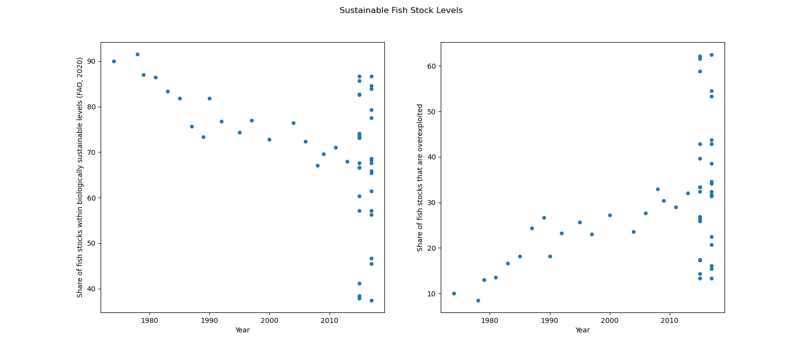
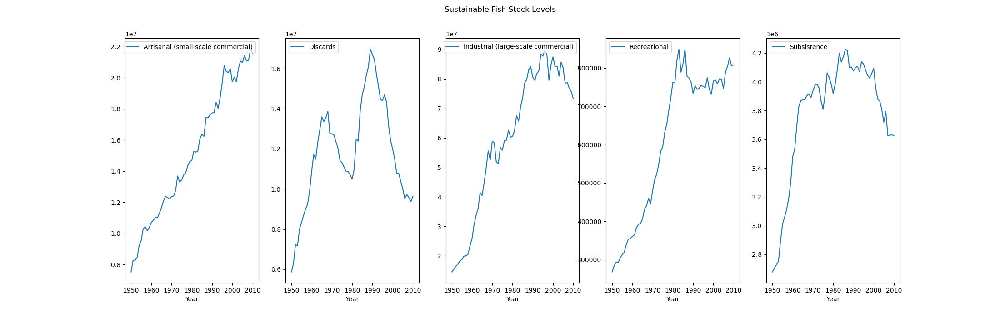

# Project Group 34: Final Report
## Introduction

Our group has chosen to explore the topic on the growing demand for fish and seafood and the affects it has on climate change. The ever growing demand resulted in growing development for both global fish and seafood production or wild capturing to meet this demand. But how does this affect climate change? With the ever growing demand will the wild fish stock be able to keep up with overfishing? Additionally, we would like to delve further into how technology can be used to aid in the effects of overfishing via aquaculture and seafood farming. Lastly, we would like to look into the extent of each country/region's overfishing trends and compare it to the their production trends. Our group chose to pursue this topic as we are very interested in sustainability and the possible affects fishing has on suatinability.

Exploratory Data Analysis

Question 1 + Results:

## Question 2

The next research question our group chose to explore was how will the results of overfishing impact our wild fish stock over the next decade? 

To begin our analysis I started by taking a look at the sustainable fish stock levels and the levels of the overexploited fish stock to get a grasp of our current situation. In the scatterplot below we can see the current state/trend from before the 1980s to after 2010. In the scatterplot on the left we can see a downward trend in the levels of sustainable fish stock levels. in the 1970s-1980s the plots were peaking around the 90% levels. On the other hand, when we take a look at the other side, 2010s and beyond, we can see that some of the points are dropping to below 40%. As you look at the points in the scatterplot for the levels of sustainable fish stock we can draw from the data that the levels of sustainable fish stock have decreased by atleast around 20% over the last 50 or so years. Therefore, we can tell that as the years have passed our fishing has become less sustainable on the fish stock. On the scatterplot on the right we can see the levels of overexploited fish stock over the years. Contrary to the plot on the left we can see an upward trend in the levels of overexploited fishing. It has generally increased by a trend of around 20% from the 1970s, approx. 10%, to 2020, approx. ~30%. Drawing conclusions from both plots in this graph we can tell that the levels of sustainable fish stock have decreased while the levels over overexploited fish have increased. 

The next step in aiding in solving our research question was determining the trend of the levels of fishing occuring. We currently know how the levels of sustainable fish stock are, but what about the amount of fishing going on? If the amount increased or decreased then it could have an impact on our sustainable levels. So to help us answer that question the graph below helps us look at the levels of fishing currently going on. In this graph we have the amount of fishing in different cateogies of fishing over the years. In every single type of fishing we can see an increase from the amount it was in the 1970s to post 2010. Despite slight fluctuations in each graph, they all follow the same general upward trend in the amount of fishing over the years.

If you combine the findings from the first graph and the findings from the second graph we can answer our research question. We know that the levels of sustainable fish stock have been going down over the years and that the amount of fishing, in every category, is going up during the years. It is likely that these findings are connected to one and another. Therefore, if the situation is going to be continuing as it currently is with the same general trends then it is likely that the amount of fishing will continue to grow and increase. If that is the case then the amount of sustainable fish stock will respond accordingly and continue to decrease as the years go on. To answer how will the results of overfishing impact our wild fish stock over the next decade, it is likely that as our overfishing continues to grow then it will negatively impact our wild fish stock and the levels of overexploitation in our fish stock will continue to grow.

More information and the full analysis notebook, code, and data can be found [here](./notebooks/lily.ipynb)

Question 3 + Results:

Conclusion: