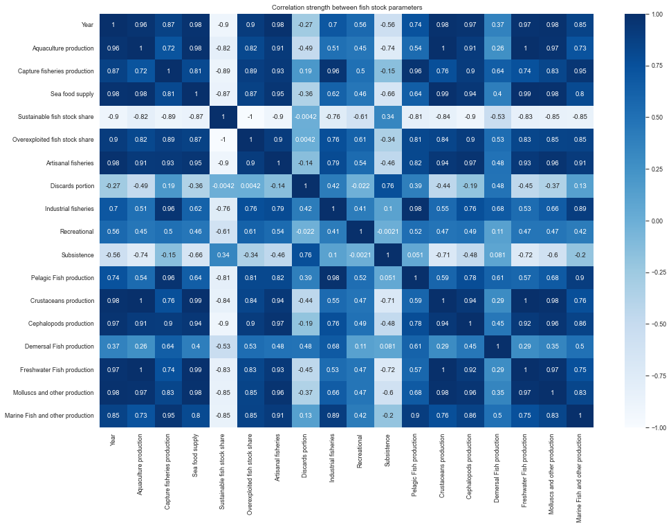
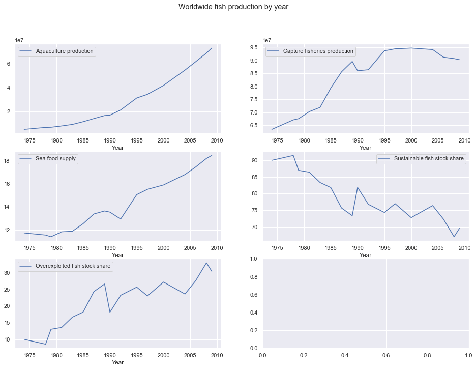
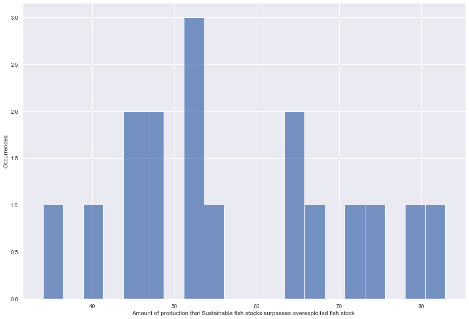
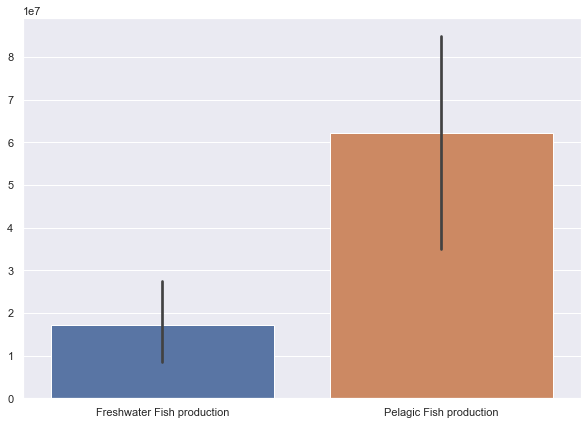
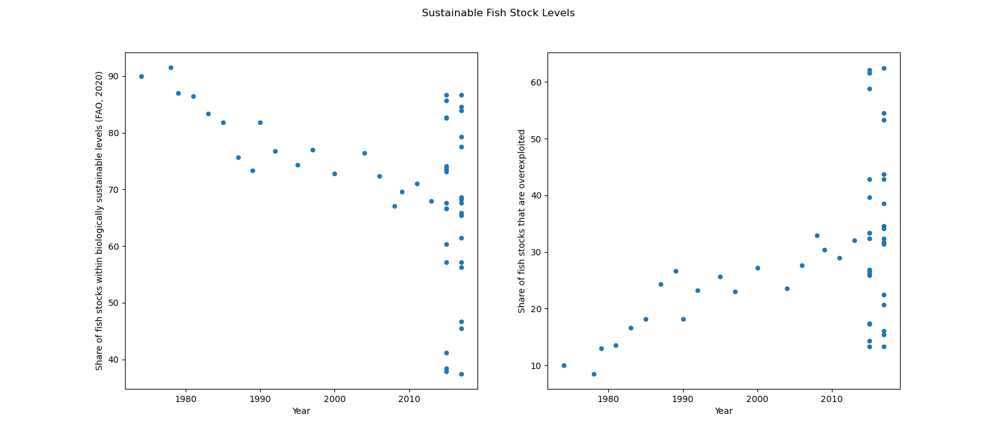
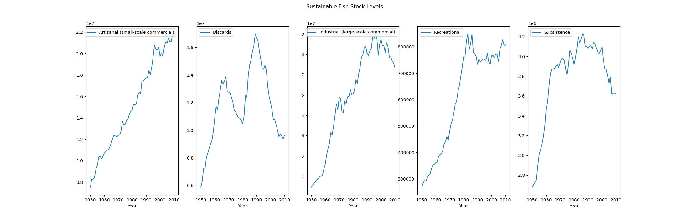

# Project Group 34: Final Report

## Introduction

Our group has chosen to explore the topic on the growing demand for fish and seafood and the affects it has on climate change. The ever growing demand resulted in growing development for both global fish and seafood production or wild capturing to meet this demand. But how does this affect climate change? With the ever growing demand will the wild fish stock be able to keep up with overfishing? Additionally, we would like to delve further into how technology can be used to aid in the effects of overfishing via aquaculture and seafood farming. Lastly, we would like to look into the extent of each country/region's overfishing trends and compare it to the their production trends. Our group chose to pursue this topic as we are very interested in sustainability and the possible affects fishing has on suatinability.

## Exploratory Data Analysis

## Question 1 and Results (Investigated by Nick):

### **Does aquaculture has reduced the serverity of overfishing and how widely adopted aquaculture farming are globally?**

To tackle this question I began comprising the raw datasets that we gathered and more specifically focusing on four attributes: *Aquaculture production, Capture fisheries production, Sustainable fish stock share and Overexploited fish stock share*. The first two parameters investigates on the production trend of Aquaculture and capture method use, allowing me to see the adoption rate and the production rate over the past decades. On the other hand, the last two parameters put focus on the possible impact of overfishing and by correlates all parameters I can see the correlation on whether the aquaculture method does helps to alleviate or slow down the captured fish production.

In my exploratory data analysis, I first started by plotting a heatmap to see the correlation strength between these variables. I found that there is a strong correlation between years and production/fish stocks. For examoke, the correlation coefficient is reasonably high for Aquaculture production and reaching 0.96, which indicates that the adoption rate of aquaculture rate are steadily increasing for the past years. Whereas the capture fisheries production, has relatively smaller coefficient at 0.87, means that capturing method are slowing phasing out from the same years span.

From the following lineplots, I can see clear postive production trend for both Aquaculture production and Captured fisheries production. However, it's apparent that the captured fisheries production fluctuated between years around 1989 to 1995 and lost almost 0.5. Comparing to the sea food supply and overexploited fish stock share, the time range is where the natural fish stock shortage suffers the most, yet we see a sharp positive climb in the sustainable fish stock share. These apprent trend showed that sustainable methods like aquaculture contributes significantly in reducing the effect of sea stock shortages and maintaing fish resource balance.

I also produced a histogram in fining the amout of production taht sustainable fish stocks surpasses overexploited. I noticed the sustainable source remains predominantly large as the difference peaks towards the centre with high occurances, meaning the overexploited stock remains minimal when compared to the sustainable stock.

These figures are two bar charts of sustainable/overfished production and freshwater/pelagic fish production. Noticed that sustainable method i.e aquaculture produces only freshwater fish, hence we can easily see the correlation between captured fish and pelagic fish production as pelagic fishes are mostly wild and cannot be farmed.

Here we can see that the aquaculture production has a slightly higher portion than the one in capture fisheries production, roughtly about 15% higher, which may indicate that Aquaculture is still the main preference for these region to produce fish. Bare in mind that the Aquaculture is part of the sustainable method that reduces the impact of climate change. However, the capture fisheries still remains large, I assumed that this change of production only happens recently by the awareness of the climate change, or perhaps it may caused by many fishery production has not made a proper transition to aquaculture, or even many fish stock avaliable is not viable for aquaculture.

It's possible from the graphs to see that there is a firm correlation between aquaculture production and freshwater fish prodution, but there isn't a clear relationship on which aquaculture reduces the impact of overfishing, in fact, the mean rate of overexploited fish stock climbs over the past decades. The dataset could be refined as most the values for countries are missing with null values, but from the data it can be seen that overexploited fish production had a major fluctuation between 1986 to 1990. The product records at 2002 was rare and has only one datapoint, resulting very small collection of datapoints hence skewing the results. Overall, the declining trend of sustainable fishing method can be an indicator that aquaculture isn't the only factor that helps to slow down the rate of overfishing, the result of reducing the impact of overfishing maybe cause by human factors and the interest of customer who made decision on the source of fish that they tend to buy.

## Question 2 and Results(Investigated by Lily):

### **The next research question our group chose to explore was how will the results of overfishing impact our wild fish stock over the next decade?**

To begin our analysis I started by taking a look at the sustainable fish stock levels and the levels of the overexploited fish stock to get a grasp of our current situation. In the scatterplot below we can see the current state/trend from before the 1980s to after 2010. In the scatterplot on the left we can see a downward trend in the levels of sustainable fish stock levels. in the 1970s-1980s the plots were peaking around the 90% levels. On the other hand, when we take a look at the other side, 2010s and beyond, we can see that some of the points are dropping to below 40%. As you look at the points in the scatterplot for the levels of sustainable fish stock we can draw from the data that the levels of sustainable fish stock have decreased by atleast around 20% over the last 50 or so years. Therefore, we can tell that as the years have passed our fishing has become less sustainable on the fish stock. On the scatterplot on the right we can see the levels of overexploited fish stock over the years. Contrary to the plot on the left we can see an upward trend in the levels of overexploited fishing. It has generally increased by a trend of around 20% from the 1970s, approx. 10%, to 2020, approx. ~30%. Drawing conclusions from both plots in this graph we can tell that the levels of sustainable fish stock have decreased while the levels over overexploited fish have increased. 

The next step in aiding in solving our research question was determining the trend of the levels of fishing occuring. We currently know how the levels of sustainable fish stock are, but what about the amount of fishing going on? If the amount increased or decreased then it could have an impact on our sustainable levels. So to help us answer that question the graph below helps us look at the levels of fishing currently going on. In this graph we have the amount of fishing in different cateogies of fishing over the years. In every single type of fishing we can see an increase from the amount it was in the 1970s to post 2010. Despite slight fluctuations in each graph, they all follow the same general upward trend in the amount of fishing over the years.

If you combine the findings from the first graph and the findings from the second graph we can answer our research question. We know that the levels of sustainable fish stock have been going down over the years and that the amount of fishing, in every category, is going up during the years. It is likely that these findings are connected to one and another. Therefore, if the situation is going to be continuing as it currently is with the same general trends then it is likely that the amount of fishing will continue to grow and increase. If that is the case then the amount of sustainable fish stock will respond accordingly and continue to decrease as the years go on. To answer how will the results of overfishing impact our wild fish stock over the next decade, it is likely that as our overfishing continues to grow then it will negatively impact our wild fish stock and the levels of overexploitation in our fish stock will continue to grow.

More information and the full analysis notebook, code, and data can be found [here](./notebooks/lily.ipynb)

## Question 3 and Results (Investigated by Livia):

Conclusion: